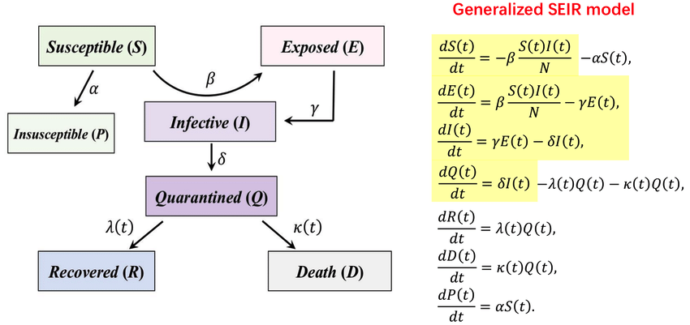
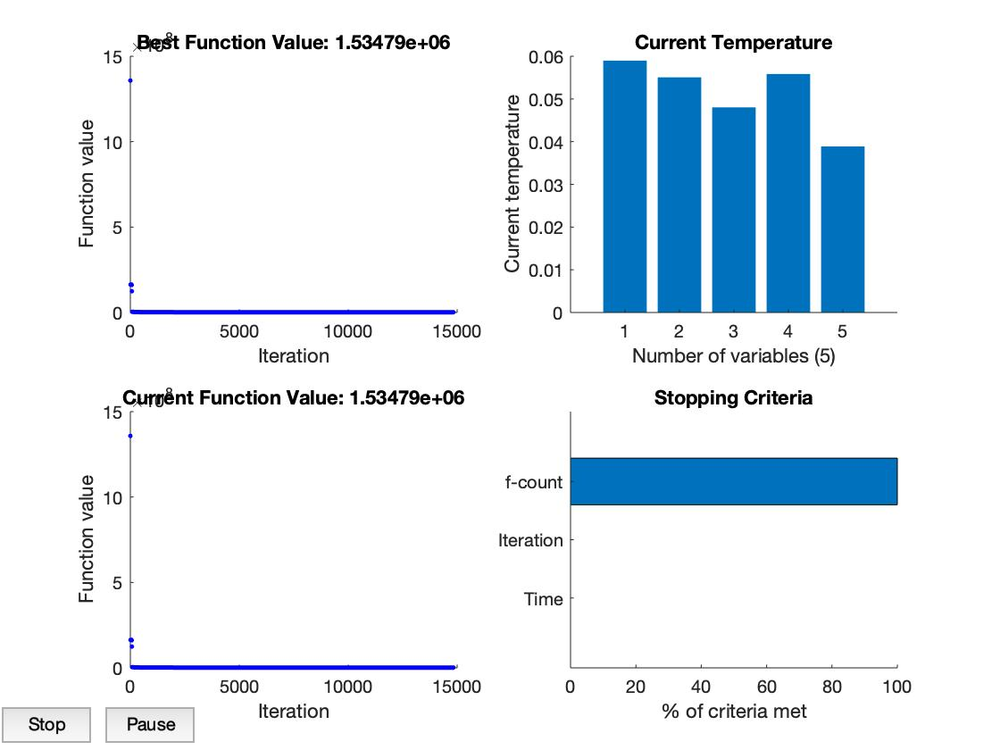
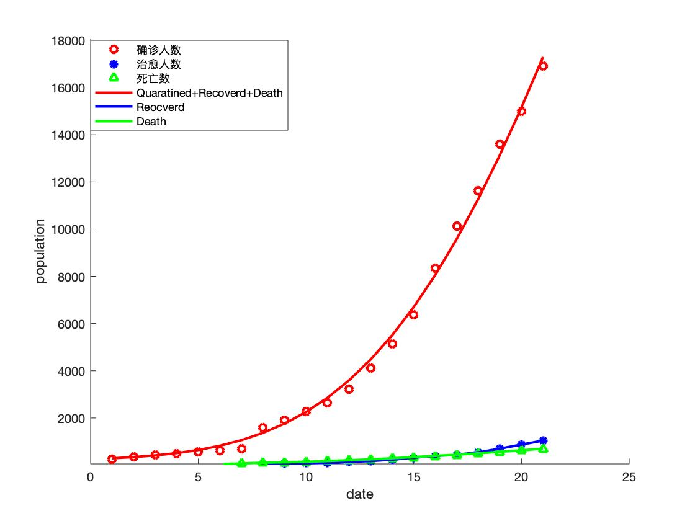
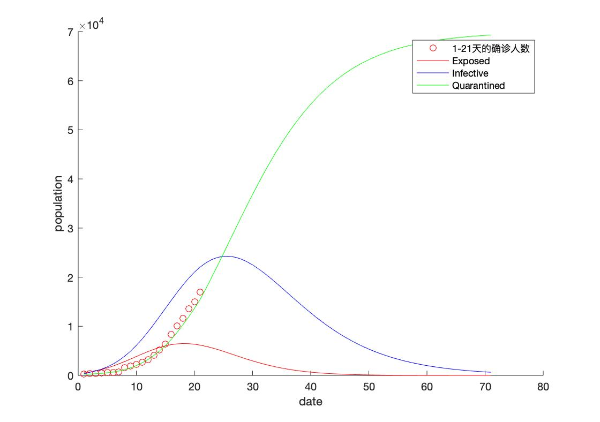
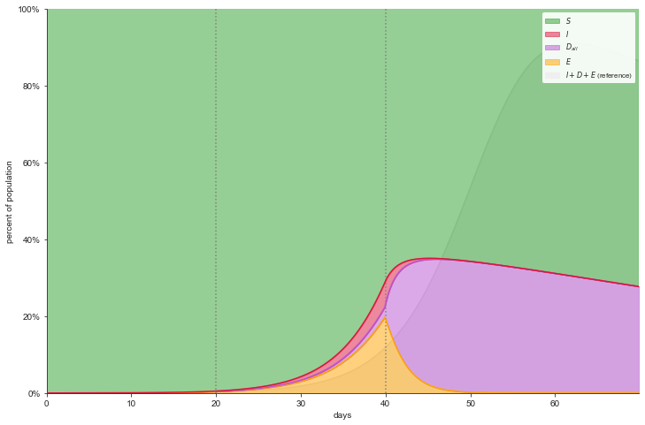

## 模型建立与假设:

| 使用符号       | 符号说明 |
| -------------- | -------- |
| S              |  易感人群数量        |
| E              |  潜伏人群数量        |
| I              | 感染人群数量         |
| R              |  恢复人群数量        |
| Q              |  隔离人群数量        |
| D              |   死亡人群数量       |
| $$\beta$$      | 传染概率          |
| $$\lambda(t)$$ |  治愈率        |
| $$\alpha$$     |  防控系数        |
| $$\sigma$$     |   1/感染者的平均隔离时间       |
| $$\kappa(t)$$  |   死亡率       |
| $$\gamma$$   |   1/平均潜伏时间      |

## 模型建立




## 模型求解：

参数估计部分使用的是模拟退火算法



得到武汉市前21天的拟合曲线



预期70天之内的曲线



## 代码

SEIRHD.m
```matlab
function y = SEIRHD(x,A)
beta=10^x(1);alpha=10^x(2);delta=1/x(3);I0=10^x(4);E0=I0*x(5);E(1)=E0;I(1)=I0;%%parameters
S(1)=14000000;N=S(1);R(1) = A(1,2);H(1) = A(1,3);D(1) = A(1,4);%%Wuhan
gamma=1/2;lambda=A(:,length(A(1,:))-1);kappa=A(:,length(A(1,:)));

%Discrete form  of SEIR model
for i=1:1:length(A(:,1))-1
    S(i+1)=S(i)-beta*S(i)*I(i)/N-alpha*S(i);
    E(i+1)=E(i)+beta*S(i)*I(i)/N-gamma*E(i);
    I(i+1)=I(i)+gamma*E(i)-delta*I(i);
    R(i+1)=R(i)+delta*I(i)-lambda(i)*R(i)-kappa(i)*R(i);
    H(i+1)=H(i)+lambda(i)*R(i);
    D(i+1)=D(i)+kappa(i)*R(i);
end

y=((R+H+D)'-A(:,2))'*((R+H+D)'-A(:,2));%Squared Errors
%you can choose other loss function
%y=((R+H+D)'-A(:,2))'*((R+H+D)'-A(:,2))/100+(H'-A(:,3))'*(H'-A(:,3))+(D'-A(:,4))'*(D'-A(:,4))*20;
%y=abs(abs(R+H+D)'-A(:,2))'*(2./(abs(R+H+D)'+A(:,2)));
%y=abs(abs(R+H+D)'-A(:,2))'*(2./(abs(R+H+D)'+A(:,2)))+abs(abs(H)'-A(:,3))'*(2./(abs(H)'+A(:,3)+1))+abs(abs(D)'-A(:,4))'*(2./(abs(D)'+A(:,4)+1));
```


fit.m
```matlab
function fit(alpha, beta, gamma, delta, A, B, S, E, I, R, H, D, N)
for i=21:1:70
    S(i+1)=S(i)-beta*S(i)*I(i)/N-alpha*S(i);
    E(i+1)=E(i)+beta*S(i)*I(i)/N-gamma*E(i);
    I(i+1)=I(i)+gamma*E(i)-delta*I(i);
    R(i+1)=R(i)+delta*I(i);
end

%%
% predict the trend of next 20 days.
%%

 figure(3)
 hold on
 plot(B(:,1),B(:,2),'or');%% incubated population
 plot(1:1:71,E','-r');
 plot(1:1:71,I','-b');
 plot(1:1:71,R','-g');
 xlabel('date')
 ylabel('population');

%%
%Fit of the incubated/healed/death population from 01/20 to 02/09
%%
figure(2)
hold on
plot(B(:,1),B(:,2),'or','LineWidth',2);%% incubated population
plot(B(:,1),B(:,3),'*b','LineWidth',2);%% healed population
plot(B(:,1),B(:,4),'^g','LineWidth',2);%% death number
plot(B(:,1),(R(:,1:21)+H+D)','-r','LineWidth',2);
plot(B(:,1),H','-b','LineWidth',2);
plot(B(:,1),D','-g','LineWidth',2);
xlabel('date')
ylabel('population');
end
```

Main_SEIRHD.m

```matlab
clear all;clc;
%%
%Description:This program is about parameter identification of SEIRHD model by using
%simulated annealing method and fit incubated population,healed population and death number.


%Please select the TXT file.
%But note that you shoule load data in the form of date,identified number,healed number,death number
% [filename filepath] = uigetfile;
B = load("2019ncov-wuhan.txt");
jumpstep = 1;
k = 0;
for i = 1:jumpstep:length(B(:,1))
    for j = 1:1:length(B(1,:))
        A(k+1,j) = B(k*jumpstep+1,j);
    end
k=k+1;
end

ObjectiveFunction = @(x) SEIRHD(x,A);%return errors to optimize parameters
X0 = [  0 -1  10   3   1];   % Starting point
LB = [ -1 -2   1   0  0.7];   % Lower bound  
UB = [  0  0  10   4   2];  % Upper bound
options = saoptimset('PlotInterval',10, ...
                     'PlotFcns',{@saplotbestf,@saplottemperature,@saplotf,@saplotstopping});
options = saoptimset(options,'InitialTemperature',100);
options = saoptimset(options,'ReannealInterval',50);
options = saoptimset(options,'TolFun',1e-100);
[x,fval,exitFlag,output] = simulannealbnd(ObjectiveFunction,X0,LB,UB,options);%simulated annealing method


beta = 10^x(1);alpha = 10^x(2);delta = 1/x(3);I0 = 10^x(4);E0 = I0*x(5);E(1) = E0;I(1) = I0;%Parameters
S(1) = 14000000;N = S(1);R(1) = A(1,2);H(1) = A(1,3);D(1) = A(1,4);%%Initial value
gamma=1/2;E(1)=E0;I(1)=I0;lambda=A(:,length(A(1,:))-1);kappa=A(:,length(A(1,:)));
% alpha =0.0852*0.95;beta =1;delta =0.1347;E0 =317.8512;I0 =389.0727;%Optimal parameters of Wuhan-the best fit 

%Discrete form  of SEIRHD model
for i=1:1:length(A(:,1))-1
    S(i+1)=S(i)-beta*S(i)*I(i)/N-alpha*S(i);
    E(i+1)=E(i)+beta*S(i)*I(i)/N-gamma*E(i);
    I(i+1)=I(i)+gamma*E(i)-delta*I(i);
    R(i+1)=R(i)+delta*I(i)-lambda(i)*R(i)-kappa(i)*R(i);
    H(i+1)=H(i)+lambda(i)*R(i);
    D(i+1)=D(i)+kappa(i)*R(i);
end

%fit and predition incubated population,healed population and death number
fit(alpha, beta, gamma, delta, A, B, S, E, I, R, H, D, N)

```

如果把隔离的人细分开并添加其他更多的因素可以得到更复杂的模型:

## 模型建立


## 模型求解



## 代码

```python
from seirsplus.models import *
import networkx
model = SEIRSModel(initN   =11080000,                # 初始人口总数
                   beta    =1,                       # S->E的概率
                   sigma   =1/14,                    # 1/潜伏期
                   gamma   =0.01322,                 # 治愈率 
                   mu_I    =0.001,                   # 死亡率
                   mu_0    =0,                       # 基准(自然)死亡率
                   nu      =0.01048,                 # 自然出生率
                   xi      =0,                       # 治愈后重新变成易感人群的概率
                   beta_D  =0.78735,                 # 检测过的人群中beta
                   sigma_D =1/14,                    # 检测过的人群中sigma
                   gamma_D =0.01322,                 # 检测过的人群中gamma
                   mu_D    =0.001,                   # 检测过的人群中mu_I
                   theta_E =0,                       # 潜伏期的检测率
                   theta_I =0,                       # 感染者的检测率
                   psi_E   =1.0,                     # 潜伏期的检测阳性率
                   psi_I   =1.0,                     # 感染期的检测阳性率
                   initI   =258,                     # 初始感染人数
                   initE   =0,                       # 初始潜伏期人数 
                   initD_E =0,                       # 初始检测到的潜伏期人数 
                   initD_I =0,                       # 初始检测到的潜伏期人数 
                   initR   =25,                      # 初始治愈人数 
                   initF   =6)                       # 初始死亡人数
checkpoints = {'t':       [20, 40],  
               'theta_E': [0.02, 0.5], 
               'theta_I': [0.02, 1]
              }
model.run(T=70, checkpoints=checkpoints)
ref_model = SEIRSModel(beta=0.78735, sigma=1/14, gamma=0.01322, mu_I=0.001, initI=258, initN=11080000) 
ref_model.run(T=300)
model.figure_infections(plot_S='stacked', vlines=checkpoints['t'], ylim=1, shaded_reference_results=ref_model)
```


